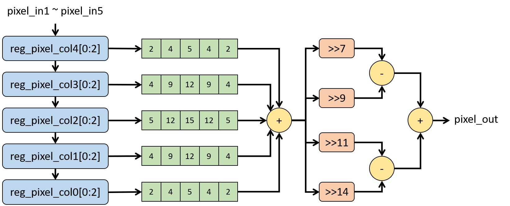
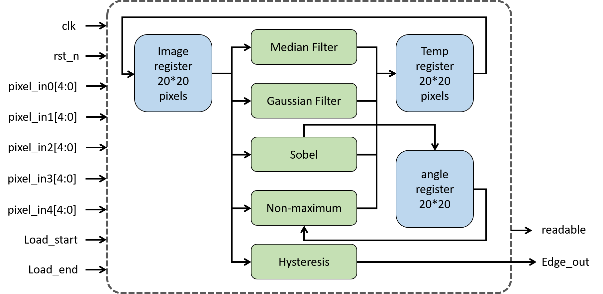

# Canny Algorithm - Edge Detection

2020 Spring IC Design Lab Final Project, NTUEE

## Introduction
We implemented the edge part of **Dade Toonify**<sup>[1](#Reference)</sup> in verilog. The color is quite simple, apply median filter and gaussian filter on the image pixels R, G, B. Quantize the colors to desired number. We decide to implement this part with python. Combine the above two, we can create cartoon effect on any image.

`CHIP/CHIP.v` is the top module, and all sub-modules have their own directories. In `Testbench/pattern`, contains all test patterns for each step, which are generated with `Testbench/bitwise_split.py`.

We load in 20 * 20 pixels of gray scale image per tile. In this implementation, we aim to process image of size 900 * 600 pixels, which requires 1350 tiles. You can change the `INPUT_TILE` in `CHIP/CHIP_tb.v` along with the in/out patterns for different size of images.

The output is 1 or 0, indicating a edge or not. `IO_process/out.py` takes the output of the circuit and re-construct an image only with edge.

## Steps and Block Diagram
### Median Filter
Change the current pixel to the median of its adjacent pixels. Get rid of too much details, which would cause too many redundant edges.


### Gaussian Filter
Current pixel become the result of convolution with a 5x5 gaussian filter. Smooth the image, also prevent too many edges.


### Sobel Gradient Calculation
Find the magnitude and the direction of gradient of the current pixel with sobel operators.


### Non-Maximum Supression
After previous steps, the edge becomes blur, non-maximum suppression can make the edge thinner.


### Hysteresis
Double threshold and Hysteresis combined, link the edges into a continuous line, and delete isolated small edges.


## Entire Block Diagram


## Usage
#### CHIP/CHIP.v
```bash
ncverilog +access+r CHIP/CHIP_tb.v CHIP/CHIP.v
```
change pattern path, input tile number in `CHIP/CHIP_tb.v`
#### Testbench/bitTrue_full.py
```bash
python3 bitTrue_full.py <image_fname>
```
generate out_golden for every step, use for debugging
#### Testbench/bitTrue_split.py
```bash
python3 bitTrue_split.py <image_fname>
```
generate out_golden in `Testbench/` and input_pixels in `Testbench/pattern/input_pixel`
#### IO_process/out.py
```bash
python3 out.py <image_fname> <image_width> <image_height>
```
show image generated with `CHIP.v`
## Reference
1. [Kevin Dade, "Toonify: Cartoon Photo Effect Application"](https://stacks.stanford.edu/file/druid:yt916dh6570/Dade_Toonify.pdf?fbclid=IwAR1gOlnXmNU__UuYD7Nf0CCpfYra8a3TEcoqNKSrLZkzdsH3rN_HOahgmfU)
2. [FienSoP/canny_edge_detector](https://github.com/FienSoP/canny_edge_detector)
